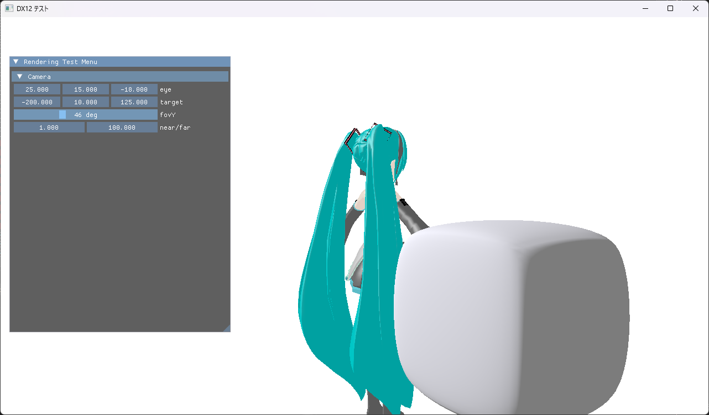
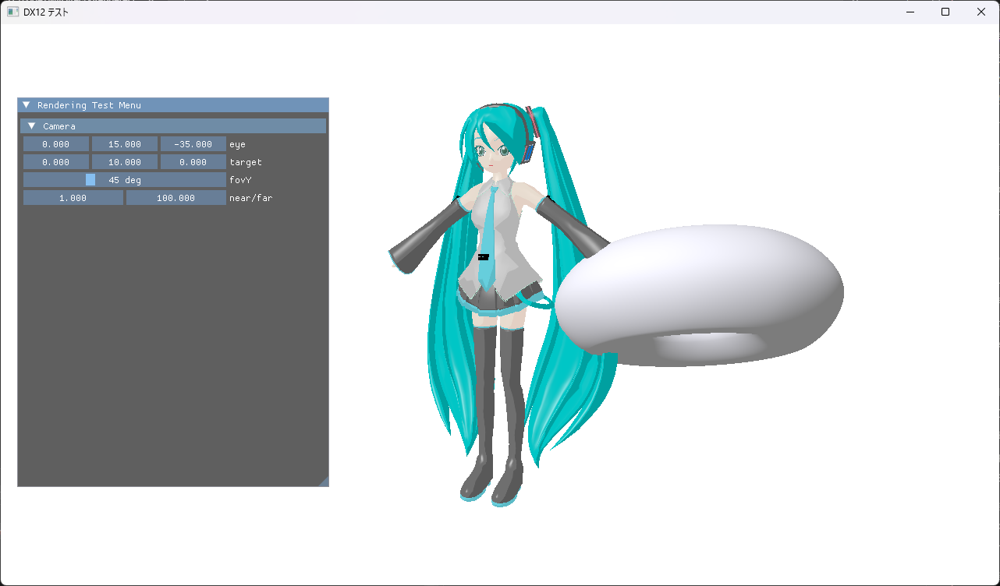

# MyDirectXRenderer

『DirectX12の魔導書』を読みながら作っている DirectX12 の学習用プロジェクト。

本の題材である PMD モデル（MMD）の表示に加えて、ラティスメッシュから Gregory 曲面を生成して表示する経路を独自に追加している。最終的には MMD モデルを動かせる自作エンジンにしつつ、大規模な形状データを扱うための仕組み（テッセレーションの GPU 化、GPU メモリ管理、プロキシ表現）を試す土台にしたい。




## 現在動くもの

### PMD モデル

- PMD ファイルのパース（頂点・インデックス・マテリアル・テクスチャパス・ボーン・IK）
- マテリアルごとの描画とテクスチャ読み込み（DirectXTex）
- **トゥーン**（`toon` テクスチャによる輝度の量子化）、**スフィアマップ**（`sph` 乗算 / `spa` 加算）、スペキュラ、アンビエント
- モデルが無い場合は読み込みをスキップして起動する

### ボーンアニメーション（VMD）

- PMD のボーン階層を `BoneNode` のツリーに組み、「センター」から `RecursiveMatrixMultiply()` で親子の行列を合成
- ボーン行列 256 本を `Transform`（`b2`）で渡し、頂点シェーダ側でスキニング（ボーン 2 本 + ウェイトの線形補間）
- VMD モーションのパースと再生。`timeGetTime()` の経過時間を 30fps 換算し、`_duration` を超えたらループする
- キーフレーム間はベジェ曲線で補間（`GetYFromXOnBezier()`）。回転はクォータニオンの Slerp、移動は X / Y / Z 軸ごとに別のカーブを使う

### IK

- 間のノード数で解法を切り替える。1 なら LookAt、2 なら余弦定理 IK、3 以上なら CCD-IK
- CCD-IK は試行回数と 1 回あたりの回転制限（`PMDIK::limit`）を PMD から読む
- ボーン名に「ひざ」を含むものを拾っておき、余弦定理 IK ではその回転軸を X 軸に固定する
- VMD の IK オンオフ情報（`VMDIKEnable`）をフレーム番号で逆引きし、オフになっている IK はスキップする

### Gregory 曲面（ラティスメッシュ）

- ハードコードしたラティスメッシュ（トーラスやキューブ）を `roundLattice()` で Gregory パッチ列に変換
- **CPU 側**で各パッチを `segments × segments` に分割して $u, v$ をサンプルし、頂点・法線・インデックスを構築（`GregoryActor::BuildMesh()`）
- 生成した三角形メッシュを通常の頂点/インデックスバッファとして描画。シェーディングは法線ベースの単色ライティングのみ

### マルチパスレンダリング（ペラポリゴン）

- オフスクリーン用のレンダーターゲットを 2 枚持ち、それぞれに RTV と SRV を張っている（`Dx12Wrapper::CreateMultiPassResource()`）
- パスは 3 段構成
  1. 3D（PMD / Gregory）をオフスクリーン 1 枚目へ描く
  2. 1 枚目を画面全体のペラポリゴン（トライアングルストリップ 4 頂点）に貼り、**横方向のガウシアンぼかし**をかけて 2 枚目へ
  3. 2 枚目を同じペラポリゴンに貼り、**縦方向のガウシアンぼかし**をかけてバックバッファへ
- ガウシアンウェイトは CPU 側で 8 個（σ = 3.0）計算し、`float4[2]` の定数バッファ（`b0`）で渡す。頂点シェーダとルートシグネチャは共通にして、ピクセルシェーダだけ違う PSO を 2 つ作って切り替えている
- `peraPixel.hlsl` には他に試したポストエフェクト（モノクロ・色反転・減色・ディザ・エンボス・シャープネス・輪郭線抽出・重み固定のガウシアン）がコメントで残っている

### 共通

- PMD と Gregory の 2 つを同一シーンに置き、`Update()` で回転させている
- ImGui によるデバッグ UI。カメラ（eye / target / fovY / near-far）をリアルタイムに変更できる。ImGui はぼかし後のバックバッファに直接描いている
- 深度バッファ、ダブルバッファリング、フェンスによる GPU 待ち

## 構成

| クラス | 役割 |
|---|---|
| `Application` | シングルトン。ウィンドウ生成、メッセージ処理、メインループ（UI 構築 → 論理更新 → 描画）、各モジュールの所有 |
| `Dx12Wrapper` | デバイス・スワップチェーン・RTV/DSV・フェンス、`BeginDraw()`/`EndDraw()`、オフスクリーンターゲットとパスの切り替え（`PreDrawToPera()` など）、バッファとテクスチャの生成 |
| `Scene` | ビュー行列・プロジェクション行列と視点位置を持つ定数バッファ（`b0`）。ImGui でのカメラ操作もここ |
| `PMDRenderer` / `PMDActor` | 前者がルートシグネチャと PSO、後者が頂点/インデックス/ワールド行列/マテリアルとディスクリプタヒープ。Actor 側がボーン階層・VMD モーション・IK ソルバも持つ |
| `GregoryRenderer` / `GregoryActor` | 同じ構造の Gregory 用。Actor がラティスメッシュとパッチ列も保持する |
| `PeraRenderer` | 画面全体を覆うペラポリゴンの頂点バッファ、ぼかしウェイトの定数バッファ、横/縦ぼかし用の PSO（`DrawHorizontal()` / `DrawVertical()`）|
| `Gregory/core` | ラティスメッシュのラウンディングと Gregory パッチの評価（描画に依存しない純粋な形状処理） |

Renderer は Actor を非所有ポインタで保持し、所有者は `Application`。

## 今の設計上の迷い

このプロジェクトで自分がまだ答えを出せていないところ。

1. **`Dx12Wrapper` の責務が広い**
   デバイス管理・フレーム制御・リソース生成が 1 クラスに同居している。Renderer を増やすたびにここが太っていくので、どこで層を切るべきか。

2. **モデル種別ごとに Renderer を分ける設計が持つのか**
   今は `PMDRenderer` / `GregoryRenderer` が各々ルートシグネチャと PSO を丸ごと持っている。種類が増えたときの共通化の置き場所が決まっていない。ペラポリゴンのパスを足した時点で「パス × モデル種別」の 2 軸になり始めていて、パスの順番は `Application::Run()` に直接書いてある。シャドウマップを入れるとさらに増えるので、リファクタリングが必要。
   やってみたい方向としては **RenderGraph**。パスごとに読み書きするリソースを宣言して、実行順とリソースの状態遷移（バリア）を自動で解決させる仕組み。パスの並びを `Application::Run()` のコードではなくデータとして持てるようになるのが狙い。まだ勉強中で、導入するかは決めていない。

3. **`Update()` / `Draw()` の責務分割**
   現在は `Application::Run()` が `Scene` と各 Actor の `Update()` を直接呼び、パス切り替えと Renderer の `Draw()` を順に並べている。アニメーションと IK を入れた結果 `PMDActor` にローダー・モーション再生・IK ソルバ・描画が同居して肥大化してきたので、どこで分けるか。方向としては 2 つ考えている。

   - **継承とポリモーフィズム**: `Actor` / `Renderer` の抽象基底クラスを作って `Update()` / `Draw()` を仮想関数にし、`Application` は `Actor` のリストを回すだけにする。今 `_pmdActor` / `_gregoryActor` を個別に持って手で並べて呼んでいる部分がそのまま解消するので、現状からは一番素直に伸ばせる。ただしこれは「Application が種類を知らなくて済む」話であって、`PMDActor` 内部の肥大化（ローダー・モーション再生・IK ソルバ・描画の同居）はクラス分割で別に解く必要がある。
   - **ECS（Entity Component System）**: 状態をコンポーネントに分け、モーション再生や IK を System 側に出す。`PMDActor` の肥大化そのものに効きそうなのはこちらだが、自分がまだ勉強不足。ECS なアーキテクチャについて勉強して、EnTT を組み込んで再設計してみたい。

   順番としては、まず基底クラスで `Application` 側の呼び出しを整えつつ `PMDActor` を役割ごとに分け、そのうえで ECS を試すのが現実的か。

4. **リソース生成の所在**
   各 Actor が `Dx12Wrapper&` を持って自分でバッファを作っている。後述の GPU メモリ上限管理を入れるなら、生成経路を一箇所に集約する必要が出てくるのではないか。

## ロードマップ

### A. 本の流れで進める学習項目

土台を揃えるための項目。順に進める予定。

- ~~ボーンアニメーション（VMD モーション再生）~~ → 実装済み（ベジェ補間まで）
- ~~IK~~ → 実装済み（LookAt / 余弦定理 / CCD-IK、VMD の IK オンオフ対応）
- マルチパスレンダリング → 進行中。オフスクリーン 2 枚とガウシアンぼかし（横・縦）まで実装済み
- シャドウマップ
- Effekseer によるエフェクト追加

### B. ラティスメッシュと大規模データのための関心（未着手）

ここがまだ問題の形しか掴めていない。

- **ラティスメッシュ→表示までの CPU 処理の GPU 化**
  現状は `BuildMesh()` で CPU 側で曲面をサンプルして三角形に落としている。ハル/ドメインシェーダによるハードウェアテッセレーションのパイプラインを別に用意し、**CPU 版と切り替えて比較できる**形にしたい。形状が動く（変形する）ケースでは CPU 側の再構築がそのままボトルネックになるはずなので。
- **GPU メモリの上限設定と管理**
  上限を明示的に持ち、それを超えるロードを事前に弾けるようにしたい。今は各 Actor が無制限に確保できる。
- **劣化表現によるプロキシとレンダリング時のメモリ最適化**
  上限に収まらない場合に、粗いテッセレーションや低解像度テクスチャのプロキシに落として表示を維持する。LOD の切り替え基準をどう決めるかが分かっていない。
- **3D 点群データの表示**
  メッシュとは別のパイプラインとして追加してみたい。

### C. 単に物作りとして興味がある

- **簡易的なモデリング / アニメーション編集機能**
  IK・アニメーション・Gregory 曲面のリアルタイム評価が揃うなら、その場で変形アニメーションを作って直せるようにしたい、という動機。エンジンからツール側への飛躍なので A / B とは分けている。

## 必要環境

- Windows 10 / 11
- Visual Studio 2022（プラットフォーム ツールセット v143）
- Windows SDK 10

## セットアップ

### 1. クローン

glm と ImGui を submodule で参照しているため `--recursive` を付ける。

```
git clone --recursive https://github.com/C4P3/MyDirectXRenderer.git
```

クローン済みの場合は:

```
git submodule update --init
```

### 2. ビルド

`MyDirectXRenderer.sln` を Visual Studio 2022 で開き、構成を **Debug / x64** にしてビルドする。

DirectXTex は NuGet パッケージなので、初回ビルド時に自動で復元される（ネットワーク接続が必要）。

## モデルデータ

### Gregory 用ラティスメッシュ

プログラム内にモデルをハードコーディングしているため、モデルを追加する必要なく Gregory 曲面の表示はそのまま動く。

### PMD モデル / VMD モーション（任意）

`MyDirectXRenderer/Model/` に `初音ミク.pmd` を置くと PMD モデルが表示される。さらに `MyDirectXRenderer/Motion/` に `squat.vmd` を置くと、そのモーションを再生する。どちらもライセンスの都合でリポジトリには含めていない（`.pmd` / `.vmd` は `.gitignore` 済み）。モデルが無い場合は読み込みをスキップする。

## 参考文献・アルゴリズム

- **ラウンディング手法**: Lattice Mesh からの曲面生成アルゴリズムは、XVL の基礎論文である [Akira Wakita, Makoto Yajima, Tsuyoshi Harada, Hiroshi Toriya, and Hiroaki Chiyokura. 2000. XVL: A Compact And Qualified 3D Representation With Lattice Mesh and Surface for the Internet.](https://scispace.com/pdf/xvl-a-compact-and-qualified-3d-representation-with-lattice-4yfa556291.pdf) をベースにしている。
- **曲面の評価式**: Gregory パッチの具体的な面の方程式や、$u, v$ パラメータから曲面上の頂点座標を計算する処理については、[Charles Loop, Scott Schaefer, Tianyun Ni, and Ignacio Castaño. 2009. Approximating subdivision surfaces with Gregory patches for hardware tessellation. ACM Trans. Graph. 28, 5 (December 2009), 1–9.](https://dl.acm.org/doi/abs/10.1145/1618452.1618497) などの文献を参考に実装を行っている。

## 依存関係

| 名前 | 取得方法 | 用途 |
|---|---|---|
| glm | submodule (`MyDirectXRenderer/External/glm`) | Gregory core が使う数学ライブラリ |
| ImGui | submodule (`MyDirectXRenderer/External/imgui`) | デバッグ UI（カメラ操作） |
| DirectXTex | NuGet (`directxtex_desktop_win10`) | テクスチャ読み込み |
| d3dx12.h | リポジトリに同梱 | D3D12 ヘルパー |
| Gregory core | `MyDirectXRenderer/Gregory/core`（別リポジトリからのコピー） | Gregory 曲面の評価と XVL ラウンディング |
